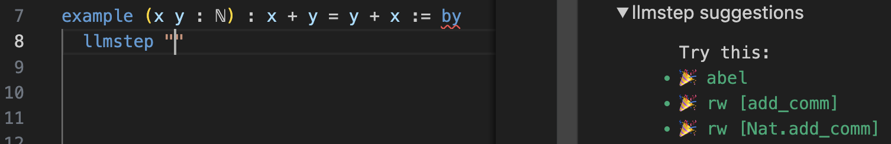
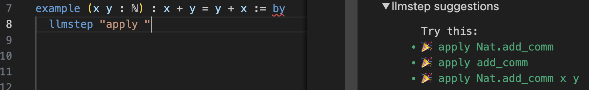

# LLM-Lean

Add to lakefile:
```lean
require llmlean from git
  "https://github.com/wellecks/llm-lean"
```

Import:
```lean
import LLMlean
```

Set `LLMLEAN_KEY` environment variable. In VSCode, press `command ,` and find `Lean4: Server Env`.

---
### `llmstep` tactic
Next-tactic suggestions via `llmstep "{prefix}"`, where `{prefix}` is arbitrary. Examples:

- `llmstep ""`

  

- `llmstep "apply "`

  

